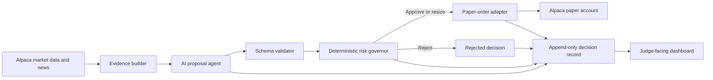

# Architecture contract

This is a design contract, not implemented code.

## Trust boundary



The AI may propose an action and explain its evidence. It may not bypass the
schema validator, risk governor, paper-only adapter, or kill switch.

## Proposed bounded workflow

1. Select one symbol from a small configured watchlist.
2. Fetch recent Alpaca bars, account state, positions, and optionally news.
3. Build a compact evidence packet with timestamps and sources.
4. Ask the AI for exactly one structured proposal: buy, sell, or hold.
5. Reject malformed, stale, unsupported, or internally inconsistent proposals.
6. Apply deterministic position, exposure, loss, frequency, and market-session
   gates.
7. Approve, resize, or reject with machine-readable reasons.
8. Require paper mode immediately before order submission.
9. Record the proposal, gate results, order request, broker response, and final
   state under one correlation ID.
10. Render the trace without exposing credentials or hidden chain-of-thought.

## Minimum proposal contract

```json
{
  "schema_version": "goblin_guard_proposal_v1",
  "symbol": "AAPL",
  "action": "buy",
  "confidence": 0.72,
  "time_horizon": "intraday",
  "requested_notional_usd": 250.0,
  "evidence_refs": ["bar-set-123", "news-item-456"],
  "thesis_summary": "Short, user-visible explanation",
  "invalidation_conditions": ["price_below_reference_low"],
  "generated_at": "2026-08-28T14:35:00Z"
}
```

The implementation should validate an explicit JSON schema. Free-form text is
display material, never execution authority. Confidence is descriptive and
does not override deterministic limits.

## Deterministic gates

Apply gates in a stable order and stop at the first hard rejection while still
recording all safe-to-evaluate results:

1. Paper account and paper endpoint verified.
2. Global kill switch off.
3. Proposal schema and version valid.
4. Symbol permitted and asset tradable.
5. Evidence fresh and source timestamps present.
6. Market/session policy satisfied.
7. No duplicate or already-pending correlated order.
8. Per-trade notional limit.
9. Per-symbol exposure limit.
10. Total portfolio exposure and cash limit.
11. Open-position limit.
12. Daily order-frequency limit.
13. Daily loss and drawdown circuit breakers.
14. Side and quantity normalized to broker constraints.

Every gate emits `pass`, `resize`, `reject`, or `unavailable`, plus a stable
reason code and user-readable explanation.

## Safety defaults

- Paper trading only; fail closed if account or endpoint mode is ambiguous.
- Long-only US equities/ETFs for the prototype.
- No options, crypto, shorting, margin, leverage, or fractional-order reliance
  unless explicitly required and tested.
- Small fixed watchlist and conservative notional ceiling.
- One outstanding order per symbol.
- Explicit global kill switch visible in the UI.
- No scheduled unattended execution for the initial demo.
- Human-triggered evaluation is the default; optional confirmation before paper
  submission is retained until the end-to-end path is proven.
- No hidden chain-of-thought storage or display. Show evidence, concise rationale,
  inputs, outputs, and gate reasons instead.

## Failure contract

- Missing or stale market data: reject; do not guess.
- AI timeout or invalid JSON: reject and record a bounded error.
- Risk-service error: reject; never default approve.
- Alpaca timeout: mark order state unknown and reconcile by client order ID
  before any retry.
- Duplicate invocation: return the existing correlated result.
- Demo hosting loses credentials: fall back to read-only synthetic replay, with
  the fallback state prominently labelled.
